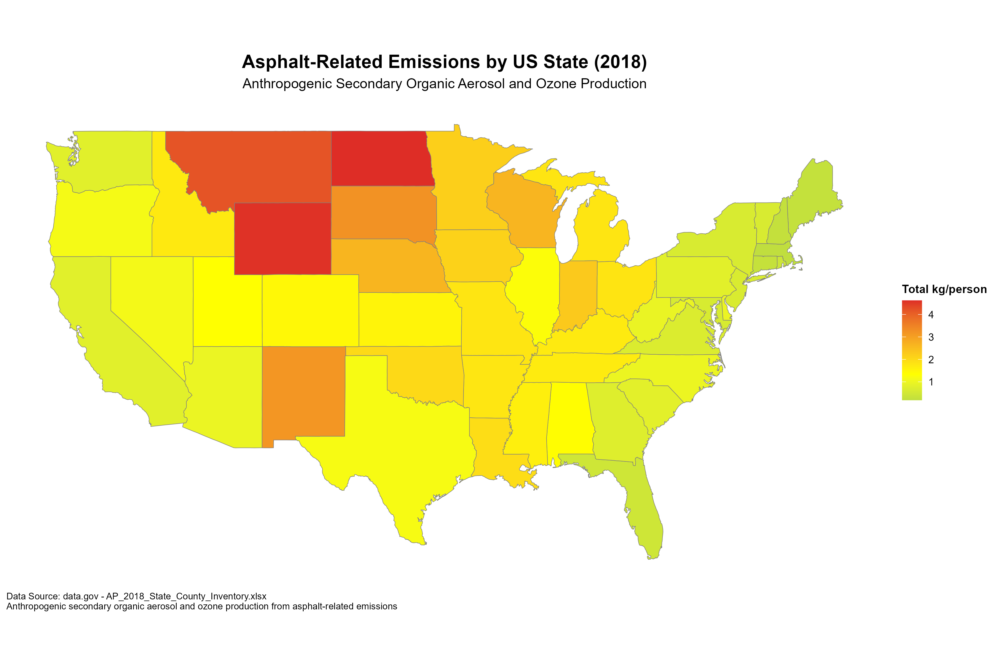

# US States Asphalt Emissions Choropleth Map

This project creates a choropleth map of US states showing asphalt-related emissions data from the 2018 State County Inventory.

## Generated Map



## Project Files

- [prompt.md](prompt.md) - Original project requirements
- [plan.md](plan.md) - Implementation plan
- [walkthrough.md](walkthrough.md) - Project walkthrough and testing results
- [create_choropleth_map.R](create_choropleth_map.R) - Main R script

## Data Source

The data comes from [data.gov](https://catalog.data.gov/dataset/data-anthropogenic-secondary-organic-aerosol-and-ozone-production-from-asphalt-related-emi):
- Dataset: Anthropogenic secondary organic aerosol and ozone production from asphalt-related emissions
- File: AP_2018_State_County_Inventory.xlsx
- Sheet: "Output - State"
- Columns: State, Total kg/person

## Usage

Run the R script to generate the choropleth map:

```r
Rscript create_choropleth_map.R
```

The script will:
1. Install/load required R packages using `pacman::p_load()`
2. Create `data/` and `plots/` directories if they don't exist
3. Download the data file from data.gov (if not already downloaded)
4. Read the "Output - State" sheet from the Excel file
5. Process the data and merge with US states map data
6. Generate a choropleth map with color coding based on "Total kg/person"
7. Save the map as a PNG file in the `plots/` folder

## Requirements

- R (version 3.5 or higher recommended)
- Required R packages (automatically installed by the script):
  - pacman
  - readxl
  - ggplot2
  - dplyr
  - maps
  - httr
  - stringr

## Project Structure

```
asphalt_emissions_2018_claude45/
├── create_choropleth_map.R
├── README.md
├── prompt.md
├── plan.md
├── walkthrough.md
├── data/
│   └── AP_2018_State_County_Inventory.xlsx
└── plots/
    └── us_states_asphalt_emissions.png
```
